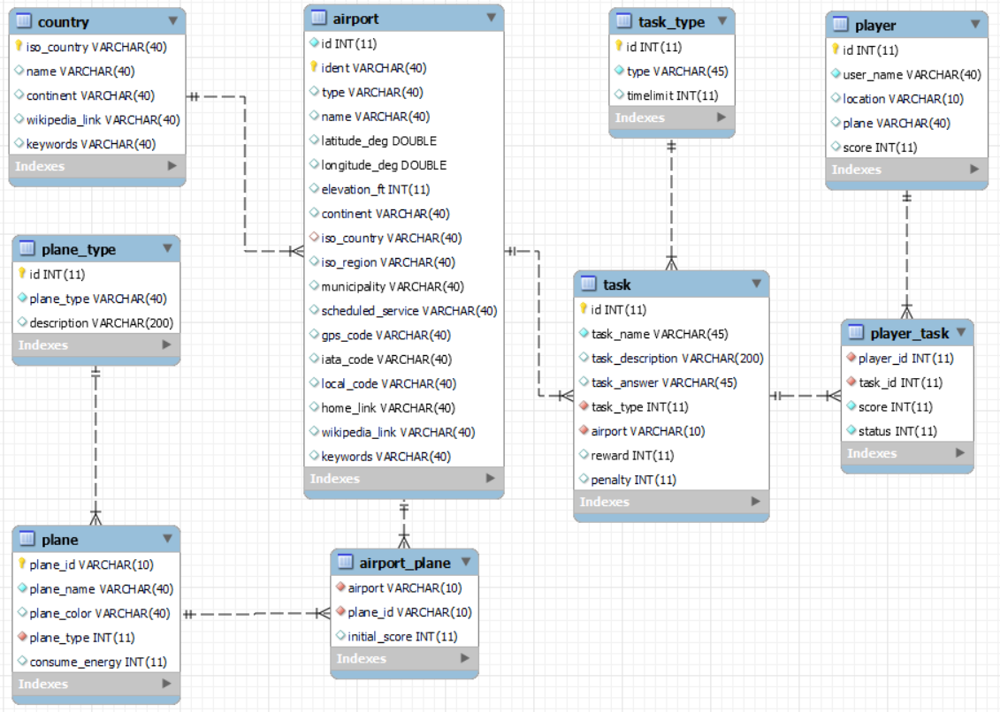

# Software 1 Project
## FLIGHT GAME
### Story


### Game flow


### Database
This game uses the airport table from the database course.

1. Create a new database 'flightgame':  
`CREATE DATABASE flightgame`;
2. Switch to that database:  
`USE flightgame`;
3. Import the same lp.sql as you did earlier in the database course:  
`source path/to/lp.sql`
4. Keep airport and contry tables, remove others:  
`SET FOREIGN_KEY_CHECKS = 0;`  
`DROP TABLE game;`  
`DROP TABLE goal;`  
`DROP TABLE goal_reached;`  
`SET FOREIGN_KEY_CHECKS = 1;`
5. Create the following tables:  
```sql
CREATE TABLE player (  
    `id` INT(11) NOT NULL AUTO_INCREMENT,  
    `user_name` VARCHAR(40) NOT NULL,  
    `location` VARCHAR(10) NULL,  
    `plane` VARCHAR(40) NULL,  
    `score` INT NULL,  
    PRIMARY KEY (`id`),  
    UNIQUE INDEX `id_UNIQUE` (`id` ASC),  
    UNIQUE INDEX `user_name_UNIQUE` (`user_name` ASC)  
)  
DEFAULT CHARACTER SET = latin1;
```


```sql
CREATE TABLE task_type (  
  `id` INT(11) NOT NULL AUTO_INCREMENT,  
  `type` VARCHAR(45) NOT NULL,  
  `timelimit` INT NULL,  
  PRIMARY KEY (`id`),  
  UNIQUE INDEX `int_UNIQUE` (`id` ASC)  
);  

INSERT INTO task_type (type, timelimit)   
VALUES ('Refill energy', null),  
('Answer question', 60);
```

```sql
CREATE TABLE task (  
  `id` INT(11) NOT NULL AUTO_INCREMENT,  
  `task_name` VARCHAR(45) NOT NULL,  
  `task_desciption` VARCHAR(200) NULL,  
  `task_answer` VARCHAR(45) NULL,  
  `task_type` INT NOT NULL,  
  `airport` VARCHAR(10) NOT NULL,  
  `reward` INT NULL DEFAULT 0,  
  `penalty` INT NULL DEFAULT 0,  
  PRIMARY KEY (`id`),  
  UNIQUE INDEX `id_UNIQUE` (`id` ASC),  
  INDEX `f_task_type_idx` (`task_type` ASC),  
  INDEX `f_airport_idx` (`airport` ASC),  
  CONSTRAINT `f_task_type`  
    FOREIGN KEY (`task_type`)  
    REFERENCES `flightgame`.`task_type` (`id`)  
    ON DELETE RESTRICT  
    ON UPDATE CASCADE,  
  CONSTRAINT `f_airport`  
    FOREIGN KEY (`airport`)  
    REFERENCES `flightgame`.`airport` (`ident`)  
    ON DELETE RESTRICT  
    ON UPDATE CASCADE
);

INSERT INTO task (task_name, task_desciption, task_answer, task_type, airport, reward, penalty)
VALUES
("Answer question", "What color are bananas?", "Yellow", 2, "00A", 20, 10),
("Answer question", "How many days are there in a week?" ,"7", 2, "00CL", 20, 10),
("Answer question", "What is the freezing point (Celsius) of water?" ,"0", 2, "EFHK", 20, 10),
("Answer question", "What's the name of a place you go to see lots of animals?" ,"The zoo", 2, "EFJO", 20, 10),
("Answer question", "If you freeze water, what do you get?" ,"Ice", 2, "00FA", 20, 10),
("Answer question", "How many planets are in our solar system?" ,"8", 2, "5A8", 20, 10),
("Answer question", "Where does Santa Claus live?" ,"The North Pole", 2, "AGGH", 20, 10),
("Answer question", "What shape is the Earth?" ,"Sphere", 2, "AT03", 20, 10),
("Answer question", "How many legs does a spider have?" ,"8", 2, "AYHK", 20, 10),
("Answer question", "How many continents are there?" ,"7", 2, "BIKF", 20, 10);
```

```sql
CREATE TABLE player_task (  
  `player_id` INT NOT NULL,  
  `task_id` INT NOT NULL,  
  `status` INT NOT NULL,  
  INDEX `f_task_idx` (`task_id` ASC),  
  CONSTRAINT `f_task`  
    FOREIGN KEY (`task_id`)  
    REFERENCES `flightgame`.`task` (`id`)  
    ON DELETE RESTRICT  
    ON UPDATE CASCADE,  
  CONSTRAINT `f_player`  
    FOREIGN KEY (`player_id`)  
    REFERENCES `flightgame`.`player` (`id`)  
    ON DELETE RESTRICT  
    ON UPDATE CASCADE
);
```

```sql
CREATE TABLE plane_type (  
  `id` INT(11) NOT NULL AUTO_INCREMENT,  
  `plane_type` VARCHAR(40) NOT NULL,  
  `description` VARCHAR(200) NULL,  
  PRIMARY KEY (`id`),  
  UNIQUE INDEX `id_UNIQUE` (`id` ASC)  
);

INSERT INTO plane_type (plane_type, description)
VALUES 
("HELICOOPTER", "maximum speed 300km/h, maximum distance 1000km, all airports"),
("LIGHT JET", "maximum speed 500km/h, maximum distance 2000km, small airports, medium airports, big airports"),
("JUMBO JET 1", "maximum speed 800km/h, maximum distance 3000km, medium airports, big airports"),
("JUMBO JET 2", "maximum speed 800km/h, maximum distance 4000km, medium airports"),
("HEAVY JET", "maximum speed 600km/h, maximum distance 5000km, big airports");
```
 
```sql
CREATE TABLE plane (  
  `plane_id` VARCHAR(10) NOT NULL,  
  `plane_name` VARCHAR(40) NOT NULL,  
  `plane_color` VARCHAR(40) NULL,  
  `plane_type` INT NOT NULL,  
  `consume_energy` INT NULL,  
  PRIMARY KEY (`plane_id`),  
  UNIQUE INDEX `id_UNIQUE` (`plane_id` ASC),  
  INDEX `f_plane_type_idx` (`plane_type` ASC),  
  CONSTRAINT `f_plane_type`  
    FOREIGN KEY (`plane_type`)  
    REFERENCES `flightgame`.`plane_type` (`id`)  
    ON DELETE NO ACTION  
    ON UPDATE NO ACTION  
);

INSERT INTO plane (plane_id, plane_name, plane_color, plane_type, consume_energy)
VALUES 
("001", " HEL-NH90", "BLACK", 1, 10),
("002", " PHE-300", "BROWN", 2, 20),
("003", "AIR-A380",  "BLUE", 3, 30),
("004", "BOE-B787",  "RED", 4, 40),
("005", "CHA-350", "wHITE", 5, 50),
("006", "GUF-G650", "GREEN", 5, 50);
```

```sql
CREATE TABLE airport_plane (  
  `airport` VARCHAR(40) NOT NULL,  
  `plane_id` VARCHAR(10) NOT NULL,  
  `initial_score` INT NULL DEFAULT 0,  
  PRIMARY KEY (`airport`, `plane_id`),  
  CONSTRAINT `f_airport_plane_airport`  
    FOREIGN KEY (`airport`)  
    REFERENCES `flightgame`.`airport` (`ident`)  
    ON DELETE RESTRICT  
    ON UPDATE CASCADE,  
  CONSTRAINT `f_airport_plane_plane`  
    FOREIGN KEY (`plane_id`)  
    REFERENCES `flightgame`.`plane` (`plane_id`)  
    ON DELETE RESTRICT  
    ON UPDATE CASCADE  
);

INSERT INTO airport_plane (airport, plane_id, initial_score)
VALUES
("00A","001", 100),
("00CL","001", 100),
("EFJO","001", 100),
("EFHK","001", 100),
("00FA","002", 200),
("EFJO","002", 200),
("EFHK","002", 200),
("5A8","003", 300),
("AGGH","003", 300),
("AT03","004", 300),
("AYHK","005", 400),
("BIKF","006", 400);
```


