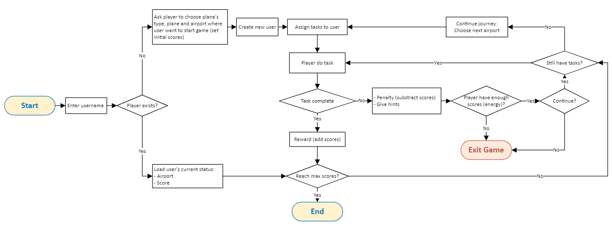

# Software 1 Project
## FLIGHT GAME
### Story


### Game flow


### Database
This game uses the airport table from the database course.

1. Create a new database 'flightgame':  
`CREATE DATABASE flightgame`;
2. Switch to that database:  
`USE flightgame`;
3. Import the same lp.sql as you did earlier in the database course:  
`source path/to/lp.sql`
4. Keep airport and contry tables, remove others:  
`SET FOREIGN_KEY_CHECKS = 0;`  
`DROP TABLE game;`  
`DROP TABLE goal;`  
`DROP TABLE goal_reached;`  
`SET FOREIGN_KEY_CHECKS = 1;`
5. Create the following tables:  
```sql
CREATE TABLE player (  
    `id` INT(11) NOT NULL AUTO_INCREMENT,  
    `user_name` VARCHAR(40) NOT NULL,  
    `location` VARCHAR(10) NULL,  
    `plane` VARCHAR(40) NULL,  
    `score` INT NULL,  
    PRIMARY KEY (`id`),  
    UNIQUE INDEX `id_UNIQUE` (`id` ASC),  
    UNIQUE INDEX `user_name_UNIQUE` (`user_name` ASC)  
)  
DEFAULT CHARACTER SET = latin1;
```


```sql
CREATE TABLE task_type (  
  `id` INT(11) NOT NULL AUTO_INCREMENT,  
  `type` VARCHAR(45) NOT NULL,  
  `timelimit` INT NULL,  
  PRIMARY KEY (`id`),  
  UNIQUE INDEX `int_UNIQUE` (`id` ASC)  
);  

INSERT INTO task_type (type, timelimit)   
VALUES ('Refill energy', null),  
('Answer question', 60);
```

```sql
CREATE TABLE task (  
  `id` INT(11) NOT NULL AUTO_INCREMENT,  
  `task_name` VARCHAR(45) NOT NULL,  
  `task_desciption` VARCHAR(200) NULL,  
  `task_answer` VARCHAR(45) NULL,  
  `task_type` INT NOT NULL,  
  `airport` VARCHAR(10) NOT NULL,  
  `reward` INT NULL DEFAULT 0,  
  `penalty` INT NULL DEFAULT 0,  
  PRIMARY KEY (`id`),  
  UNIQUE INDEX `id_UNIQUE` (`id` ASC),  
  INDEX `f_task_type_idx` (`task_type` ASC),  
  INDEX `f_airport_idx` (`airport` ASC),  
  CONSTRAINT `f_task_type`  
    FOREIGN KEY (`task_type`)  
    REFERENCES `flightgame`.`task_type` (`id`)  
    ON DELETE RESTRICT  
    ON UPDATE CASCADE,  
  CONSTRAINT `f_airport`  
    FOREIGN KEY (`airport`)  
    REFERENCES `flightgame`.`airport` (`ident`)  
    ON DELETE RESTRICT  
    ON UPDATE CASCADE
);
```

```sql
CREATE TABLE player_task (  
  `player_id` INT NOT NULL,  
  `task_id` INT NOT NULL,  
  `status` INT NOT NULL,  
  INDEX `f_task_idx` (`task_id` ASC),  
  CONSTRAINT `f_task`  
    FOREIGN KEY (`task_id`)  
    REFERENCES `flightgame`.`task` (`id`)  
    ON DELETE RESTRICT  
    ON UPDATE CASCADE,  
  CONSTRAINT `f_player`  
    FOREIGN KEY (`player_id`)  
    REFERENCES `flightgame`.`player` (`id`)  
    ON DELETE RESTRICT  
    ON UPDATE CASCADE
);
```

```sql
CREATE TABLE plane_type (  
  `id` INT(11) NOT NULL AUTO_INCREMENT,  
  `plane_type` VARCHAR(40) NOT NULL,  
  `description` VARCHAR(200) NULL,  
  PRIMARY KEY (`id`),  
  UNIQUE INDEX `id_UNIQUE` (`id` ASC)  
);
```
 
```sql
CREATE TABLE plane (  
  `plane_id` VARCHAR(10) NOT NULL,  
  `plane_name` VARCHAR(40) NOT NULL,  
  `plane_color` VARCHAR(40) NULL,  
  `plane_type` INT NOT NULL,  
  `comsume_energy` INT NULL,  
  PRIMARY KEY (`plane_id`),  
  UNIQUE INDEX `id_UNIQUE` (`plane_id` ASC),  
  INDEX `f_plane_type_idx` (`plane_type` ASC),  
  CONSTRAINT `f_plane_type`  
    FOREIGN KEY (`plane_type`)  
    REFERENCES `flightgame`.`plane_type` (`id`)  
    ON DELETE NO ACTION  
    ON UPDATE NO ACTION  
);
```

```sql
CREATE TABLE airport_plane (  
  `airport` VARCHAR(40) NOT NULL,  
  `plane_id` VARCHAR(10) NOT NULL,  
  `initial_score` INT NULL DEFAULT 0,  
  PRIMARY KEY (`airport`, `plane_id`),  
  CONSTRAINT `f_airport_plane_airport`  
    FOREIGN KEY (`airport`)  
    REFERENCES `flightgame`.`airport` (`ident`)  
    ON DELETE RESTRICT  
    ON UPDATE CASCADE,  
  CONSTRAINT `f_airport_plane_plane`  
    FOREIGN KEY (`plane_id`)  
    REFERENCES `flightgame`.`plane` (`plane_id`)  
    ON DELETE RESTRICT  
    ON UPDATE CASCADE  
);
```
```task_type table
INSERT INTO task_type(type, timelimit)
VALUES
("1", "SOLVE PROBLEM", "60"),
("2", "REFUELING", "120");
```
```fk for airport_plane
ALTER TABLE airport_plane
    DROP FOREIGN KEY f_airport_plane_airport;
ALTER TABLE airport
    ADD INDEX type(type) USING BTREE;
ALTER TABLE airport_plane
    ADD CONSTRAINT FK_airport_plane_airport FOREIGN KEY(airport) REFERENCES airport(type)ON UPDATE CASCADE ON DELETE CASCADE;
```
```airport_plane table
INSERT INTO airport_plane(airport, plane_id, initial_score)
VALUES
("heliport", "001", "100"),
("small_airport", "001", "100"),
("medium_airport", "001", "100"),
("large_airport", "001", "100"),
("small_airport", "002", "100"),
("medium_airport", "002", "100"),
("large_airport", "002", "100"),
("medium_airport", "003", "100"),
("large_airport", "003", "100"),
("medium_airport", "004", "100"),
("large_airport", "005", "100"),
("large_airport", "006", "100");
```
```task table
ALTER TABLE task
    DROP FOREIGN KEY f_airport;
ALTER TABLE task
    modify COLUMN airport VARCHAR(20);
    
INSERT INTO task(id, task_name, task_desciption, task_answer, task_type, airport, reward, penalty)
VALUES
("1", "arrage sentence", "being green stones at 3 small airport ", "3 green stones being at small airport", "1",
 "large_airport", "10", "20"),
("2", "arrage sentence", "being green stones at 3 small airport ", "3 green stones being at small airport", "1",
 "small_airport", "10", "20"),
("3", "arrage sentence", "being green stones at 3 small airport ", "3 green stones being at small airport", "1",
 "medium_airport", "10", "20"),
("4", "arrage sentence", "being green stones at 3 small airport ", "3 green stones being at small airport", "1",
 "heliport", "10", "20"),
("5", "buy information", " get position of final stone", "yes", "1", "heliport", "0", " 150"),
("6", "buy information", " get position of final stone", "yes", "1", "small_aiport", "0", " 150"),
("7", "buy information", " get position of final stone", "yes", "1", "medium_airport", "0", " 150"),
("8", "buy information", " get position of final stone", "yes", "1", "large_airport", "0", " 150");
```


